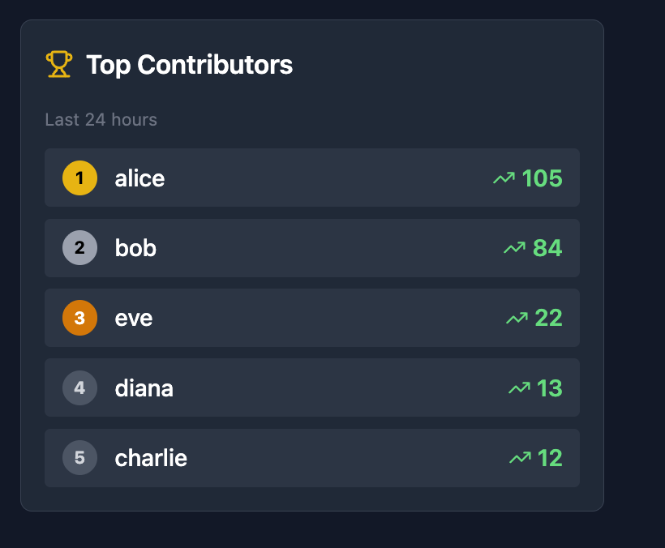

# Community Feed

A threaded discussion platform featuring infinite nesting and a time-windowed leaderboard.

## Project Overview

This project implements a social feed where users can post, comment (with nested replies), and vote. It focuses on performance optimization for threaded conversations and accurate time-based aggregation for the leaderboard.

### Key Features
* **Threaded Comments:** Supports infinite depth nesting. Optimized to load full trees in O(1) database queries.
* **24h Leaderboard:** Ranks users based on karma earned strictly within the last 24 hours.
* **Concurrency:** Prevents race conditions on voting using database-level constraints.

## Visuals

| The Feed | The Leaderboard |
|:--------:|:---------------:|
|  |  |

<br>

**Deeply Nested Comments (Level 5+)**


## Tech Stack
* **Backend:** Python, Django Rest Framework (DRF)
* **Frontend:** React, TypeScript, Tailwind CSS
* **Database:** PostgreSQL (via Docker) or SQLite (Local default)

## How to Run Locally

### Prerequisites
* Python 3.10+
* Node.js 18+

### 1. Backend Setup
```bash
cd backend
python -m venv venv
source venv/bin/activate  # On Windows: venv\Scripts\activate
pip install -r requirements.txt
python manage.py migrate
```

### 2. Load Demo Data
I have included a script to generate a deep conversation tree immediately for testing.
```bash
python manage.py force_thread
# Output: "Success! Added mega thread to Post..."
```

### 3. Frontend Setup
```bash
cd ../frontend
npm install
npm run dev
```
Access the app at `http://localhost:5173`.

## Architecture Notes
For details on how the N+1 problem was solved and the SQL logic for the leaderboard, please see [EXPLAINER.md](EXPLAINER.md).
