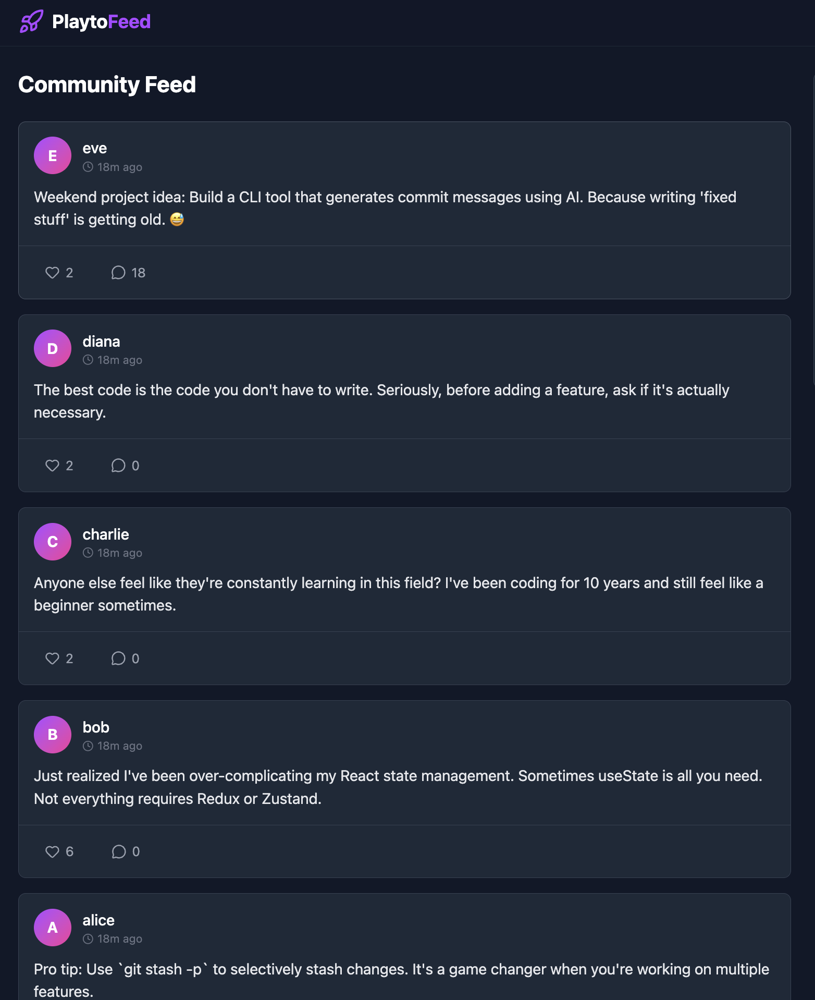
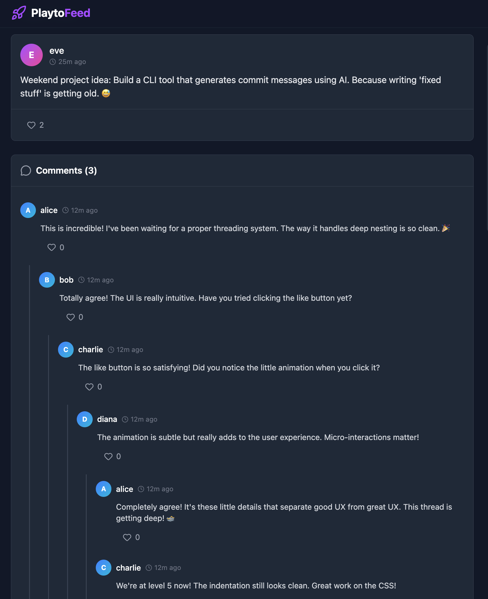

# Community Feed

A high-performance threaded discussion platform featuring infinite nesting and a time-windowed leaderboard.

##  Live Demo
* **Frontend:** [https://community-feed-iota.vercel.app/](https://community-feed-iota.vercel.app/)
* **Backend:** [https://feed-backend-vyk1.onrender.com](https://feed-backend-vyk1.onrender.com)

## Project Overview
This project implements a social feed where users can post, comment (with nested replies), and vote. It focuses on performance optimization for threaded conversations and accurate time-based aggregation for the leaderboard.

### Key Features
* **Threaded Comments:** Supports infinite depth nesting. Optimized to load full trees in O(1) database queries (Solved N+1 problem).
* **24h Leaderboard:** Ranks users based on karma earned strictly within the last 24 hours using SQL window aggregation.
* **Concurrency Safety:** Database-level constraints prevent race conditions on voting.

## Visuals
**The Feed & Leaderboard**


**Deeply Nested Comments (Level 5+)**


## Tech Stack
* **Backend:** Python, Django Rest Framework (DRF)
* **Frontend:** React, TypeScript, Tailwind CSS
* **Infrastructure:** PostgreSQL, Docker

## How to Run Locally

### 1. Backend Setup
```bash
cd backend
python -m venv venv
source venv/bin/activate
pip install -r requirements.txt
python manage.py migrate
# Load Demo Data
python manage.py force_thread
python manage.py seed_activity
```

### 2. Frontend Setup
```bash
cd ../frontend
npm install
npm run dev
```

## Notes
For a deep dive into the SQL logic used for the leaderboard and the tree serialization strategy, please read [EXPLAINER.md](EXPLAINER.md).
